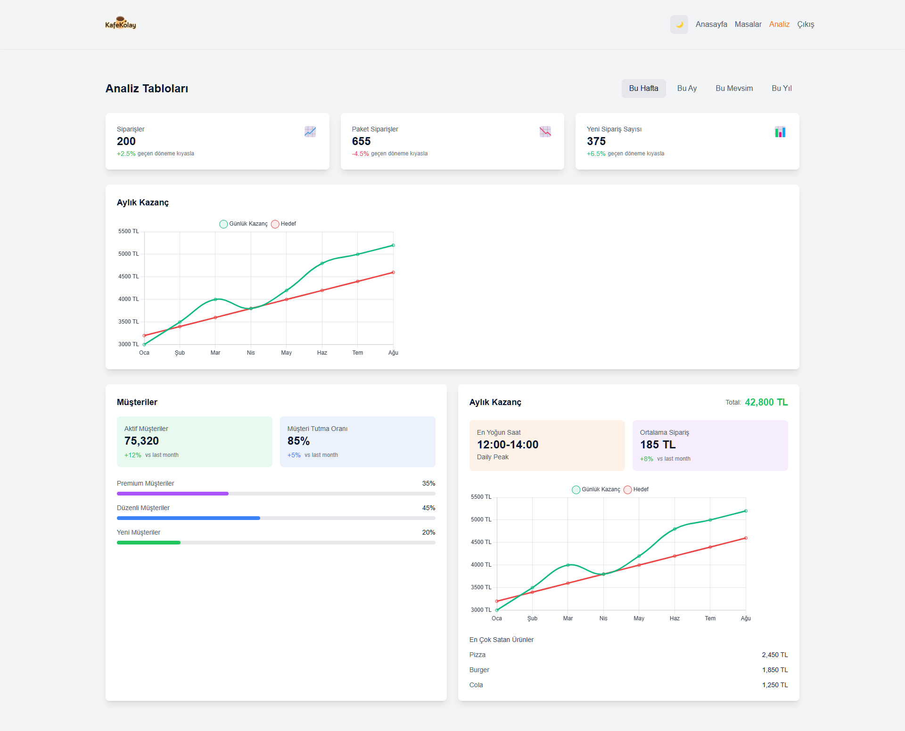
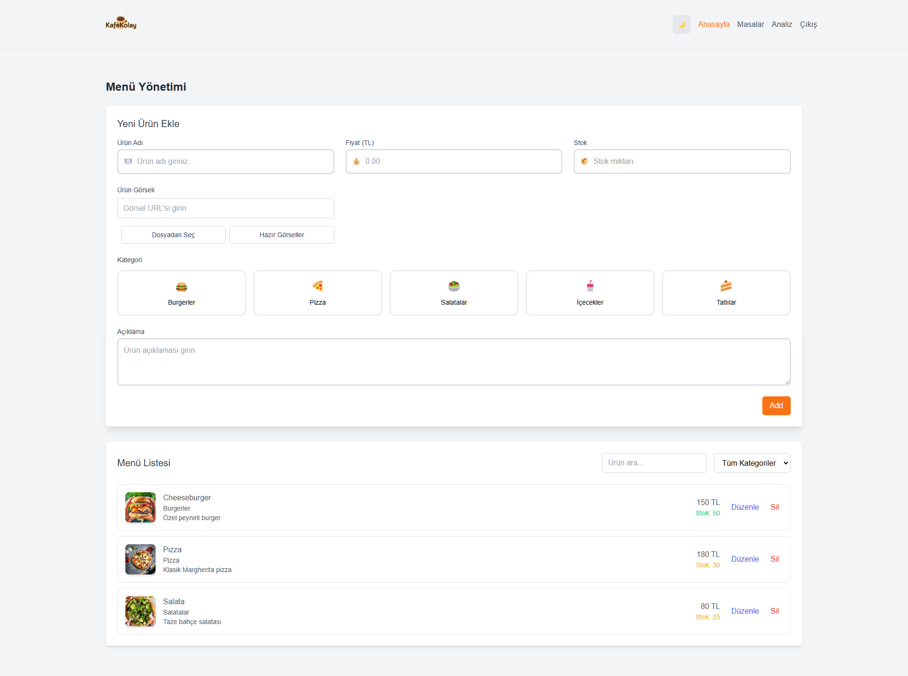
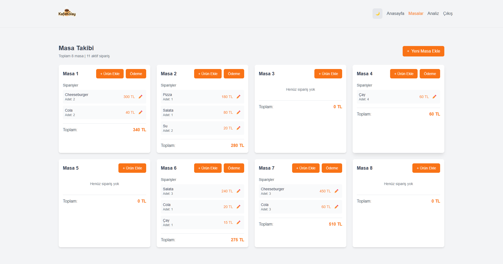
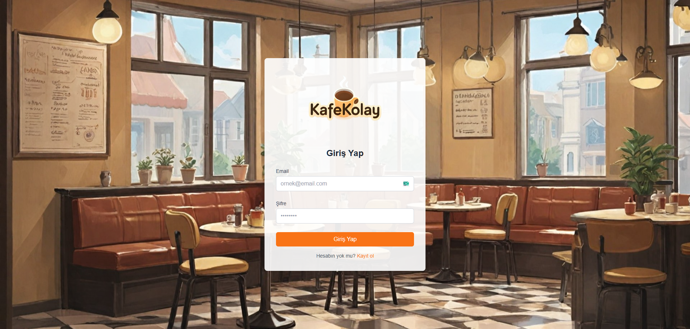
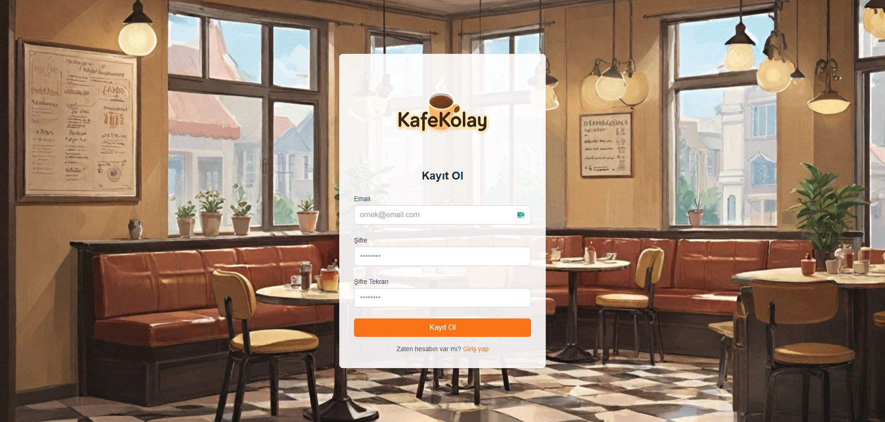

# KafeKolay - Cafe Management SaaS Platform

<p align="center">
  
</p>

KafeKolay is a modern, user-friendly cafe management system built with React. It provides comprehensive tools for cafe owners to manage their business efficiently, including table management, analytics, and order tracking.

## Features

### 📊 Analytics Dashboard
Track your business performance with detailed analytics and visualizations.


### 🏠 Main Dashboard
Get an overview of your cafe's current status, including active orders and daily statistics.


### 🪑 Table Management
Easily manage your cafe's tables and track their status in real-time.


### 🔐 Secure Authentication
Protect your data with our secure login and registration system.

#### Login Screen


#### Registration Screen


## Technology Stack

- React.js
- Firebase Authentication
- TailwindCSS
- Chart.js for Analytics
- Framer Motion for Animations

## Getting Started

### Prerequisites

- Node.js (v14 or higher)
- npm or yarn

### Installation

1. Clone the repository
```bash
git clone https://github.com/ibrahimsezer/kafekolay.git
```

2. Install dependencies
```bash
npm install
```

3. Start the development server
```bash
npm start
```

Live server is [https://kafekolay.web.app](https://kafekolay.web.app)
The application will be available at [http://localhost:3000](http://localhost:3000)

## Contributing

Contributions are welcome! Please feel free to submit a Pull Request.

## License

This project is licensed under the MIT License - see the LICENSE file for details.

## Contact

Ibrahim Sezer - [GitHub](https://github.com/ibrahimsezer)

Project Link: [https://github.com/ibrahimsezer/kafekolay](https://github.com/ibrahimsezer/kafekolay)
